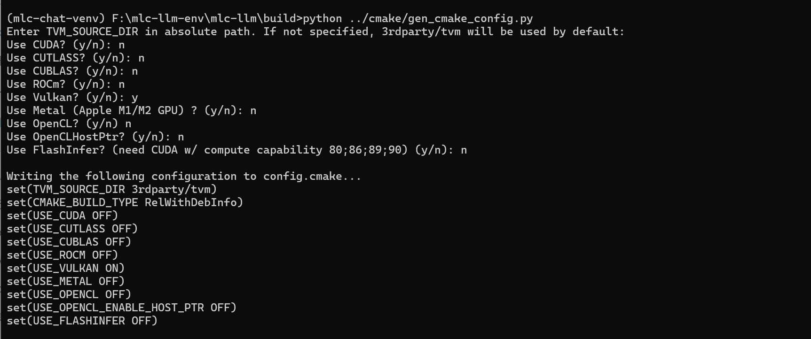
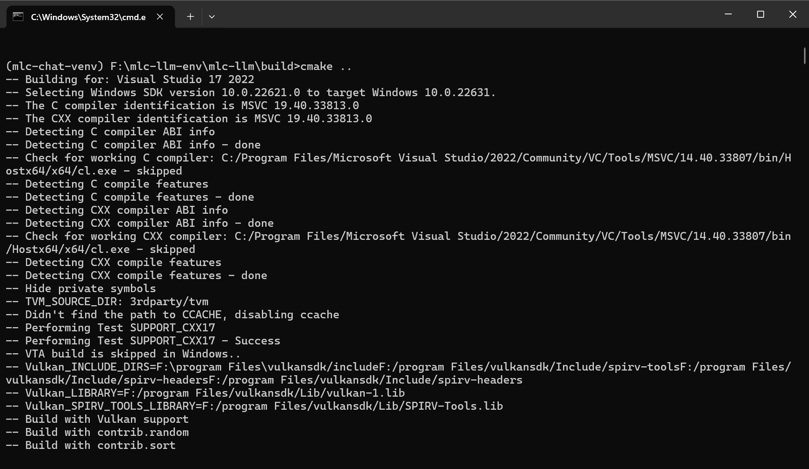
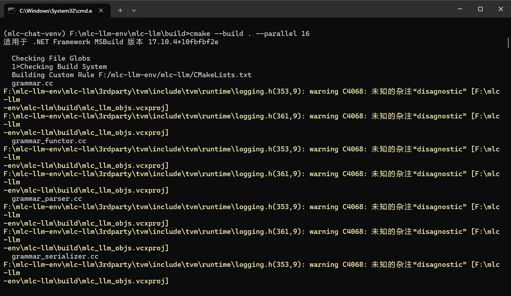
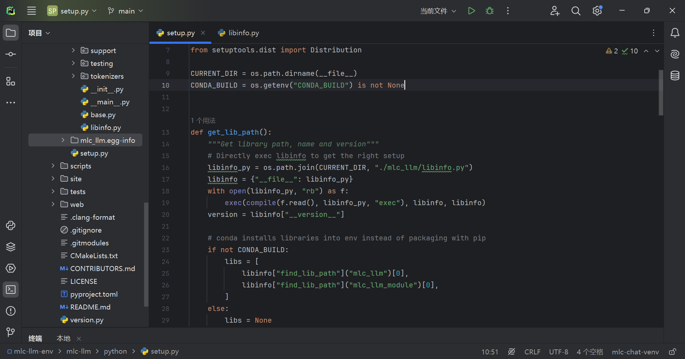
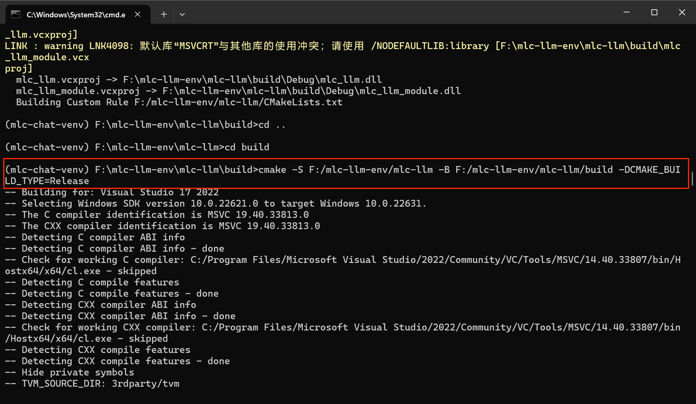
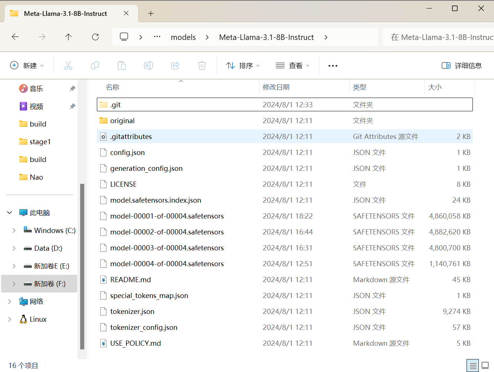

# windows 环境
## CLI
> MLC Chat CLI is the command line tool to run MLC-compiled LLMs out of the box interactively.

### 一、Install MLC-LLM Package
#### Build from Source
#### Step 1. Set up build dependency.
 To build from source, you need to ensure that the following build dependencies are satisfied:

+ CMake >= 3.24

+ Git

+ Rust and Cargo, required by Hugging Face’s tokenizer

+ One of the GPU runtimes:

    + CUDA >= 11.8 (NVIDIA GPUs)

    + Metal (Apple GPUs)

    + Vulkan (NVIDIA, AMD, Intel GPUs)

```
# make sure to start with a fresh environment
conda env remove -n mlc-chat-venv
# create the conda environment with build dependency
conda create -n mlc-chat-venv -c conda-forge \
    "cmake>=3.24" \
    rust \
    git \
    python=3.11
# enter the build environment
conda activate mlc-chat-venv
```
#### Step 2. Configure and build.
 A standard git-based workflow is recommended to download MLC LLM, after which you can specify build requirements with our lightweight config generation tool:
 ```
# clone from GitHub
git clone --recursive https://github.com/mlc-ai/mlc-llm.git && cd mlc-llm/
# create build directory
mkdir -p build && cd build
# generate build configuration
python ../cmake/gen_cmake_config.py
# build mlc_llm libraries
cmake .. && cmake --build . --parallel $(nproc) && cd ..
```
python ../cmake/gen_cmake_config.py

cmake ..（这步配置项目的构建环境应该是正确的，即使后面有一些failed。这些警告和错误提示是由于平台差异引起的，对于Windows平台上的构建过程是可以忽略的）


F:\mlc-llm-env\mlc-llm\build>cmake --build . --parallel 16

<font color="#dd0000">在后续操作中出现找不到mlc_llm.dll的错误，反推到这里出现了问题。但是这条命令可以正常执行，结果在build文件夹中创建了个debug文件夹。里面含有mlc_llm中唯一的mlc_llm.dll文件。后续'pip install -e .'操作中运行setup.py失败</font><br /> 

<font color="#dd0000">发现在libinfo.py中搜索的是release版本，于斯给他手动填加了搜索debug，此命令可以顺利执行，但是后续'mlc_llm chat -h'时还是有问题。</font><br /> 


<font color="#dd0000">然后尝试重新指定生成release版本的'(mlc-chat-venv) F:\mlc-llm-env\mlc-llm\build>cmake -S F:/mlc-llm-env/mlc-llm -B F:/mlc-llm-env/mlc-llm/build -DCMAKE_BUILD_TYPE=Release'生成的还是debug，没有变。通过对比两个CMakeCache.txt文件里都是'CMAKE_BUILD_TYPE:UNINITIALIZED=Release
'没变。于是修改了CMakeLists.txt文件。</font><br /> 

<font color="#dd0000">然后尝试重新指定生成release版本的'(mlc-chat-venv) 于是修改了CMakeLists.txt文件。强制设置构建类型为Release。再次cmake。</font><br /> 

<font color="#dd0000">CMakeCache.txt文件确实变成release版本的，但是实际还是生成了debug文件夹，通过对比mlc_llm.dll二者文件大小，并没有发生变化。</font><br /> 

#### Step 3. Install via Python. 
We recommend that you install mlc_llm as a Python package, giving you access to mlc_llm.compile, mlc_llm.MLCEngine, and the CLI. 
**通过环境变量安装**
```
export MLC_LLM_SOURCE_DIR=/path-to-mlc-llm
export PYTHONPATH=$MLC_LLM_SOURCE_DIR/python:$PYTHONPATH
alias mlc_llm="python -m mlc_llm"
```
**通过pip本地项目安装**
```
conda activate your-own-env
which python # make sure python is installed, expected output: path_to_conda/envs/your-own-env/bin/python
cd /path-to-mlc-llm/python
pip install -e .
```


#### Step 4. Validate installation. 
You may validate if MLC libarires and mlc_llm CLI is compiled successfully using the following command:
```
# expected to see `libmlc_llm.so` and `libtvm_runtime.so`
ls -l ./build/
# expected to see help message
mlc_llm chat -h
```
<font color="#dd0000">但是我在运行mlc_llm chat -h的时候，出现了错误：OSError: [WinError 1114] 动态链接库(DLL)初始化例程失败。</font><br /> 


Finally, you can verify installation in command line. You should see the path you used to build from source with:
```
python -c "import mlc_llm; print(mlc_llm)"
```
## 二、Compile Model Libraries
>To run a model with MLC LLM in any platform, we need:
>1. Model weights converted to MLC format 
>2. Model library that comprises the inference logic

前提：（安装TVM Unity 编译器）
### Install TVM Unity Compiler
#### Prebuilt Package
```
conda activate your-environment
python -m pip install --pre -U -f https://mlc.ai/wheels mlc-ai-nightly
```
验证：
```
python -c "import tvm; print(tvm.__file__)"
```


#### 1. Clone from HF and convert_weight
You can be under the mlc-llm repo, or your own working directory. Note that all platforms can share the same compiled/quantized weights.
```
# Create directory
mkdir -p dist/models && cd dist/models
# Clone HF weights
git lfs install
git clone https://huggingface.co/meta-llama/Meta-Llama-3.1-8B-Instruct
cd ../..
# Convert weight
mlc_llm convert_weight ./dist/models/Meta-Llama-3.1-8B-Instruct/ ^
    --quantization q4f16_1 ^
    -o dist/Meta-Llama-3.1-8B-Instruct-q4f16_1-MLC

```
>hf下载太慢，我采用了镜像站下载https://hf-mirror.com/meta-llama/Meta-Llama-3.1-8B-Instruct

